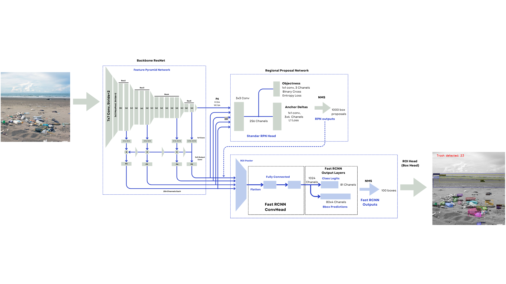
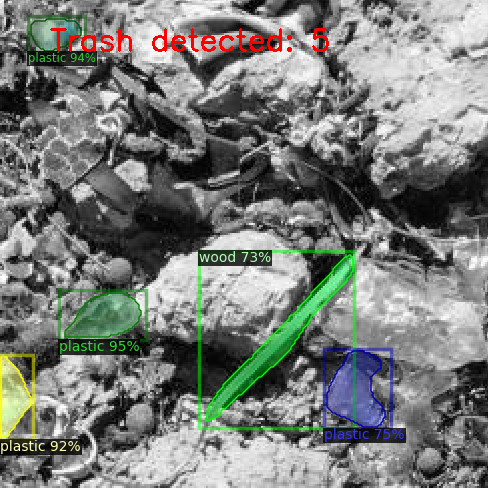

# Deteksi-Objek-Sampah-Pantai-Menggunakan-framework-Detectron2

```
📍 Members Of The Group 10 :
1. Maria Gresia Hutabarata 
2. Yunike Priskila Sitorus Pane
3. Anisa Dini Amalia  
4. Rangga Adi Putra 
5. Ghozi Alvin Karim   
```

Detectron 2 is a next-generation, open-source object detection system from Facebook AI Research. With this framework it is possible to use and train various state-of-the-art models for detection tasks such as boundary-box detection, instance and semantic segmentation, and person keypoint detection.
[Paper Detectron2](https://arxiv.org/abs/2307.05826) Other [Paper Detectron2](https://www.researchgate.net/publication/365801835_Detectron2_Object_Detection_Manipulating_Images_using_Cartoonization) and Facebookresearch [Github](https://github.com/facebookresearch/detectron2).


## Detectron2 Architecture


R-CNN with Feature Pyramid Network is a basic Bounding box detector that can be extended to Mask R-CNN.

## Dataset 
The dataset used to detect objects is sourced from [Roboflow](https://universe.roboflow.com/ia-as1oj/ia-beachbot2). This Detectron2 model uses **2591** as Train data to train several labels and images to detect types of waste such as :

- cardboard
- fabrics
- glass
- metal
- plastic
- wood

## Evaluation 

❗Validation Per-category Bounding Box

| Category  | Images| instances| Average Precision|
|-----------|-------|----------|------------------|
| cardboard | 511   | 63       | 32.805           |
| fabrics   | 511   | 294      | 9.349            |
| glass     | 511   | 86       | 56.616           |
| metal     | 511   | 72       | 47.301           |
| plastic   | 511   | 712      | 46.582           |
| wood      | 511   | 53       | 18.880           |
| other     | 511   | 140      | 3.42             |

|mAP@[IoU=0.50]  |mAR@[IoU=0.50]  |
|----------------|----------------|
| 0.307          | 0.393          |
| 0.492          | 0.534          |
| 0.356          | 0.558          |
| 0.229          | 0.448          |
| 0.336          | 0.613          |
| 0.497          | 0.647          |
---
* Kategori dengan Performa Baik:
1. glass: 56.62% AP – Performa deteksi terbaik, menunjukkan model sangat baik mendeteksi objek glass.
2. metal: 47.30% AP – Deteksi cukup kuat untuk objek metal.
3. plastic: 46.58% AP – Performa baik untuk kategori yang dominan di dataset.

* Kategori dengan Performa Buruk:
1. other: 3.42% AP – Model sangat kesulitan mendeteksi objek kategori ini.
2. fabrics: 9.35% AP – Performa rendah, kemungkinan karena kemiripan dengan kategori lain atau kurangnya data pelatihan.
3. wood: 18.88% AP – Performa di bawah rata-rata.
---

❗Validation Per-category Segmentation

| Category  | Images| instances| Average Precision|
|-----------|-------|----------|------------------|
| cardboard | 511   | 63       | 36.465           |
| fabrics   | 511   | 294      | 8.234            |
| glass     | 511   | 86       | 62.830           |
| metal     | 511   | 72       | 52.038           |
| plastic   | 511   | 712      | 49.970           |
| wood      | 511   | 53       | 14.752           |
| other     | 511   | 140      | 1.497            |

|mAP@[IoU=0.50]  |mAR@[IoU=0.50]  |
|----------------|----------------|
| 0.323          | 0.398          |
| 0.482          | 0.533          |
| 0.377          | 0.558          |
| 0.202          | 0.430          |
| 0.401          | 0.619          |
| 0.477          | 0.561          |

---
* Kategori dengan Performa Baik:
1. glass: 62.83% AP – Segmentation sangat baik, melampaui performa bounding box detection
2. metal: 52.04% AP – Segmentation kuat pada kategori ini.
3. plastic: 49.97% AP – Performa konsisten dengan deteksi bounding box.

* Kategori dengan Performa Buruk:
1. other: 1.50% AP – Segmentation hampir gagal untuk objek ini.
2. fabrics: 8.23% AP – Performa sangat rendah, serupa dengan bounding box detection.
3. wood: 14.75% AP – Performa rendah meski ada sedikit perbaikan dibanding bounding box detection.
---

## Results 

 


## References

[1] [Facebook AI Research, Detectron2. GitHub. Accessed: Dec. 7, 2024.](https://github.com/facebookresearch/detectron2).

[2] [Detectron2 Object Detection: Manipulating Images using Cartoonization, ResearchGate, 2024.](https://www.researchgate.net/publication/365801835_Detectron2_Object_Detection_Manipulating_Images_using_Cartoonization)

[3] [He, K., Gkioxari, G., Dollár, P., & Girshick, R. (2017). Mask R-CNN. arXiv. Retrieved December 7, 2024,](https://arxiv.org/pdf/1703.06870v3)
